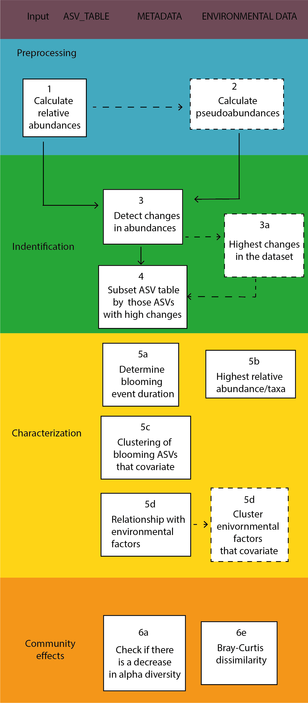

TODO:
- fix folde /data. Is needes? (now in buildignore)
- Remove get_anomalies_season, Nacho_workflow_demo.R, data-raw
 and work_flow.R (now in buildignore)
- tests are failing (both get and evenness)
- examples fail, recheck
- Datasets (if any) need documentation.
-


<!-- README.md is generated from README.Rmd. Please edit that file -->

```{r, include = FALSE}
knitr::opts_chunk$set(
  collapse = TRUE,
  comment = "#>",
  fig.path = "man/figures/README-",
  out.width = "100%"
)
```

# Bloomers

<!-- badges: start -->
[](https://github.com/EcologyR/templateRpackage/actions/workflows/R-CMD-check.yaml)
[](https://app.codecov.io/gh/EcologyR/templateRpackage?branch=master)
`r badger::badge_lifecycle("experimental")`
`r badger::badge_repostatus("WIP")`
<!-- `r badger::badge_codefactor("ecologyr/templaterpackage")` -->
<!-- badges: end -->

The main objective of "Bloomers" package is to detect sharp changes in abundances for individual taxa in microbial communities. A bloomer is defined as a taxa that has a fast and significant increase in a community compared to the rest of species. Examples are given for bacteria found in the Mediterranean season. 

## Installation

``` r
# install.packages("devtools")
devtools::install_github("EcologyR/Bloomers")
```

The code to create this package is available [here](https://github.com/EcologyR/Bloomers).

## The workflow of the bloomers package is summarized in the following graph



## Example

This is a basic example which shows you how to solve a common problem:

```{r example}
# library(Bloomers)
## basic example code

```

What is special about using `README.Rmd` instead of just `README.md`? You can include R chunks like so:

```{r cars}
summary(cars)
```

You'll still need to render `README.Rmd` regularly, to keep `README.md` up-to-date. `devtools::build_readme()` is handy for this. You could also use GitHub Actions to re-render `README.Rmd` every time you push. An example workflow can be found here: <https://github.com/r-lib/actions/tree/v1/examples>.

Put here a plot representing blooming species and how we do detect anomalies

```{r plot.bloomers, echo = TRUE, eval = FALSE}
#load("./data/bloomersdata.rda")

#plot(bloomersdata$pseudoabundance) #improve this example 

```

In that case, don't forget to commit and push the resulting figure files, so they display on GitHub and CRAN.

## Citation

If using this package, please cite it:

```{r comment=NA}
#citation("Bloomers")
```


## Funding

Put your funding here from the Institut de Ciencies del Mar


